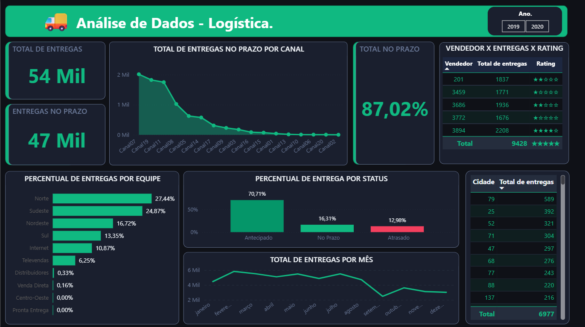

# 🚚 Análise de Dados — Logística — Power BI

Dashboard operacional de logística com foco em desempenho de entregas por canal, equipe, status e vendedor — combinando métricas de pontualidade com um sistema de rating dinâmico calculado via DAX para ranquear fornecedores por volume de entregas.

## 📸 Preview do Dashboard



---

## 🎯 Problema de negócio

Operações logísticas geram grandes volumes de dados de entrega, mas raramente transformam esses dados em indicadores acionáveis por equipe ou canal. Este dashboard responde perguntas práticas para gestores de logística: qual percentual das entregas está sendo cumprido no prazo? Quais canais concentram mais entregas? Quais equipes lideram em volume? E quais vendedores merecem destaque pelo desempenho?

---

## 🔍 Principais insights

- **87,02% das entregas foram realizadas no prazo ou antecipadas** (47 Mil de 54 Mil totais) — taxa sólida, mas os 12,98% de atrasos representam aproximadamente 7 Mil entregas, volume relevante para uma operação logística.
- **Entregas antecipadas superam as no prazo**: 70,71% antecipadas contra apenas 16,31% no prazo exato — o que pode indicar folgas generosas nos prazos acordados, algo que vale revisar na política de SLA.
- **Canal 07 lidera com folga**, com cerca de 2 Mil entregas no prazo — mais que o dobro do segundo colocado. Os últimos canais (Canal 20, Canal 02) têm volume marginal, sugerindo canais em desuso ou de nicho.
- **Equipe Norte responde por 27,44% das entregas**, seguida de Sudeste (24,87%) — juntas, as duas regiões concentram mais da metade do volume total.
- **Vendedor 3894 tem o maior volume de entregas** (2.208) e rating de 4 estrelas — enquanto o Vendedor 3686 tem 1.936 entregas e rating de 5 estrelas, sugerindo que volume absoluto não é o único critério de desempenho.
- **Queda visível de entregas a partir de julho**, com recuperação parcial em outubro/novembro — padrão sazonal que merece acompanhamento para planejamento de capacidade no segundo semestre.

---

## 📄 Estrutura do dashboard

O relatório é composto por uma única página com os seguintes visuais:

| Visual | Descrição |
|---|---|
| **KPI — Total de Entregas** | Contagem total de registros na base (54 Mil) |
| **KPI — Entregas no Prazo** | Total de entregas antecipadas ou no prazo (47 Mil) |
| **KPI — Total no Prazo %** | Percentual calculado via DAX (87,02%) |
| **Total de Entregas no Prazo por Canal** | Gráfico de área com ranking decrescente por canal |
| **Vendedor x Entregas x Rating** | Tabela com volume de entregas e rating em estrelas gerado por DAX |
| **Percentual de Entregas por Equipe** | Barras horizontais com participação percentual por equipe/região |
| **Percentual de Entrega por Status** | Gráfico de barras com três categorias: Antecipado, No Prazo e Atrasado |
| **Total de Entregas por Mês** | Série temporal mensal de janeiro a dezembro |
| **Cidade x Total de Entregas** | Tabela com volume por cidade (identificadas por código) |

**Filtro disponível:** Ano (2019 e 2020).

---

## 🛠️ Stack técnica

- **Ferramenta:** Power BI Desktop
- **Transformação de dados (Power Query):** ajuste de tipos de dado, promoção de cabeçalhos e configuração da fonte

**Medidas DAX desenvolvidas:**

```dax
-- Contagem base de entregas
Total Entrega = COUNTROWS(Logistica)
```

```dax
-- Entregas dentro do prazo (antecipadas ou no prazo)
Total Entregas no prazo =
CALCULATE(
    [Total Entrega],
    FILTER(
        Logistica,
        Logistica[Status_Entrega] = "Antecipado"
            || Logistica[Status_Entrega] = "No prazo"
    )
)
```

```dax
-- Percentual de entregas no prazo
% No Prazo =
DIVIDE(
    [Total Entregas no prazo],
    [Total Entrega],
    0
)
```

```dax
-- Sistema de rating dinâmico em estrelas (normalizado entre 1.500 e 2.500 entregas)
Rating =
VAR __MAX_NUMBER_OF_STARS = 5
VAR __MIN_RATED_VALUE = 1500
VAR __MAX_RATED_VALUE = 2500
VAR __BASE_VALUE = [Total Entrega]
VAR __NORMALIZED_BASE_VALUE =
    MIN(
        MAX(
            DIVIDE(
                __BASE_VALUE - __MIN_RATED_VALUE,
                __MAX_RATED_VALUE - __MIN_RATED_VALUE
            ),
            0
        ),
        1
    )
VAR __STAR_RATING = ROUND(__NORMALIZED_BASE_VALUE * __MAX_NUMBER_OF_STARS, 0)
RETURN
    IF(
        NOT ISBLANK(__BASE_VALUE),
        REPT(UNICHAR(9733), __STAR_RATING)
            & REPT(UNICHAR(9734), __MAX_NUMBER_OF_STARS - __STAR_RATING)
    )
```

---

## 📊 Fonte dos dados

Dataset de operações logísticas com cobertura de 2019 a 2020, originalmente utilizado em curso de formação em dados. O dashboard, as medidas DAX, os visuais, a formatação e a estrutura analítica foram desenvolvidos de forma independente.

---

## 🔗 Acesse o relatório

[Acesse o dashboard](https://app.powerbi.com/view?r=eyJrIjoiZjYxODMwY2UtY2QxYi00NWQxLWE5NGYtZTZiYThmN2JlMzBkIiwidCI6ImIyZTE2Mjk3LTJlZDYtNDFiOC1iODIyLWE5NTRlOTViZDJmMCIsImMiOjR9)

---

## 📌 Limitações e próximos passos

- **70,71% das entregas são antecipadas** — antes de interpretar como eficiência, vale verificar se os prazos acordados estão calibrados de forma realista ou se há margem excessiva que mascara a performance real.
- As cidades estão identificadas apenas por **código numérico**, sem nome — enriquecer essa dimensão com nomes reais tornaria a análise geográfica muito mais comunicável para stakeholders.
- O rating de vendedores é baseado exclusivamente em **volume de entregas** — uma próxima iteração poderia incorporar a taxa de pontualidade por vendedor, cruzando volume com qualidade de entrega.
- **Dados de apenas 2 anos (2019–2020)** limitam análises de tendência de longo prazo — ampliar a base histórica revelaria se os padrões sazonais observados se repetem ano a ano.
